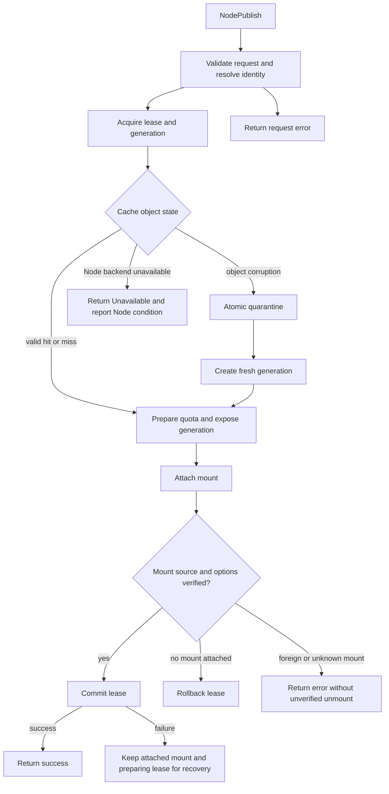
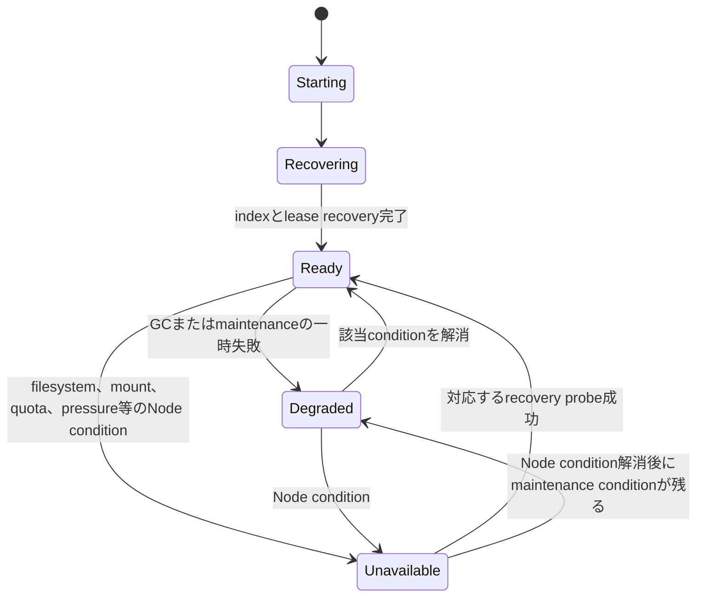
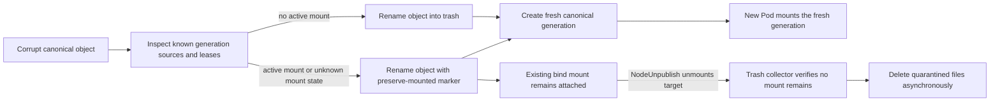
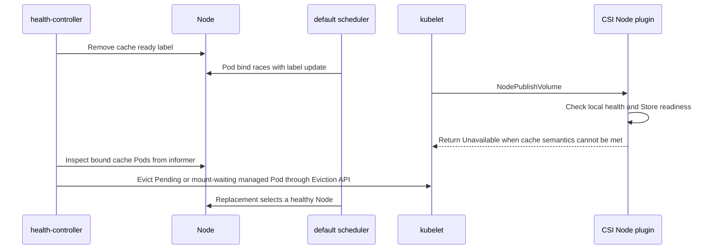

# Cache CSI Driver

Cache CSI DriverはKubernetesのCSI inline ephemeral volumeとしてNode-local cache directoryを提供します。`NodePublishVolume`が成功した場合、そのNode上で要求された意味論を満たすcache generationを利用できます。Podのvolume leaseはPod削除時に解除しますが、cache dataはNode上に残り、同じ`CacheClass`と`cacheKey`を指定する後続Podから再利用できます。

このdriverはKubernetes 1.37以降を対象とします。CSI inline volumeはbest-effort cacheであり、データの永続性、Node間共有、容量の予約を提供しません。Node障害、容量圧迫、CacheClassの保持期限、またはdriverのGCによりcacheはいつでも破棄されます。アプリケーションはcache miss後にデータを再生成できる必要があります。

## インストール

Helm OCI chartを使ってインストールします。

```sh
helm install cache-csi-driver \
  oci://ghcr.io/walnuts1018/charts/cache-csi-driver \
  --version 0.1.0 \
  --namespace kube-system
```

このchartは`CacheClass` CRD、`CSIDriver`、MutatingAdmissionPolicy、ValidatingAdmissionPolicy、RBAC、ServiceAccount、Node DaemonSet、health-controller Deploymentをインストールします。ValidatingAdmissionPolicyは、namespaceに`cache.csi.walnuts.dev/allow-use=true`ラベルがない場合にCache CSI volumeを使うPodを拒否します。CacheClassを利用させるnamespaceには、namespaceラベルを変更できる利用者を管理した上で次のようにラベルを付けてください。

```sh
kubectl label namespace default cache.csi.walnuts.dev/allow-use=true
```

Admission policyは必須です。Pod作成時にCache CSI inline ephemeral volumeを検証し、`cacheClass`と`cacheKey`を必須にして未知属性を拒否します。`maxBytes`を指定した場合は正のKubernetes quantityである必要があります。MutatingAdmissionPolicyはCache CSI volumeを持つPodの既存`nodeSelector`を保ったまま`cache.csi.walnuts.dev/ready: "true"`を追加します。ユーザーが指定した`schedulerName`は変更しません。CREATE時に`spec.nodeName`を指定してschedulerを迂回するPodは拒否します。既存の別値でready labelと競合するselectorも拒否します。PodのNamespaceとServiceAccount UIDを取得できない場合やCacheClassを解決できない場合はNodePublishを失敗させ、代替filesystemで成功させません。Helm valuesの`admissionPolicy.cacheClassAllowlist.enabled=true`を指定すると、namespace annotation `cache.storage.walnuts.dev/allowed-cache-classes`に列挙されたCacheClassだけを利用できます。値はカンマ区切りで、annotation keyはHelm valuesから変更できます。Node DaemonSetのServiceAccount token自動mountは無効で、Node plugin containerだけに読み取り用projected tokenを渡します。Node pluginはmount system callを使うためprivilegedかつ`hostPID`有効のcontainerとして動作し、mount属性付きmountの伝播にLinux kernel 5.12以降が必要です。cacheは各Nodeの`/var/lib/cache-csi`に保存されます。保存先を変更する場合はHelm valuesの`cacheRootDir`を設定してください。この値はNode上のhostPathとpluginの引数の両方に反映され、`kubeletRootDir`と重複できません。

CacheClassは各Node pluginのdynamic informer cacheから参照します。PodのNamespace、name、UID、ServiceAccount.nameはCSIの`podInfoOnMount`から取得します。NamespaceとServiceAccountのUIDはNodePublishの解決時にKubernetes APIへGETし、同一objectへの同時GETだけsingleflightで共有します。成功したUIDをTTL cacheへ保存しないため、一時的なAPI障害でidentityを確認できない場合に古いUIDを使わず、NodePublishはエラーになります。NamespaceまたはServiceAccountが存在しない場合やAPI accessが拒否された場合も、設定・権限エラーとしてpublishを拒否します。CacheClass informerのcold start中や通常Storeのlease recovery中も、NodePublishは要求されたcacheを確保できないためエラーになります。NamespaceとServiceAccountのwatchは行わず、CacheClass informerのwatchだけがNode数に比例します。各publishではNamespaceとServiceAccount scopeのCacheClassに限りServiceAccountのUIDをAPIへ確認するため、大規模クラスタではpublish量とAPI serverのGET負荷を考慮してください。

cache object単体のmetadataまたはgeneration構造に破損を検出した場合、Node pluginはそのobjectを再利用対象からatomicにquarantineし、空のgenerationを作成します。この処理が完了すればcache missとしてNodePublishを成功させます。cache rootのread-only化、filesystem I/O error、容量枯渇、安全なdirectory作成・rename・fsyncの失敗、必要なquota機構の障害など、Node全体がcacheを提供できない場合はNodePublishを失敗させ、要求されたcacheが使えると報告しません。要求したquotaに達したcacheは通常どおり`ENOSPC`になります。

Node pluginは`/health`から`phase`、bounded `reason`、`evict`を含むJSONを公開します。health-controllerはNodeとNode plugin DaemonSet Podのinformerを使い、現在のNode UIDとDaemonSet Pod UIDを照合してPod IPのhealth endpointを並列数を制限してprobeします。`Ready`と`Degraded`ではhealth-controllerがNodeへ`cache.csi.walnuts.dev/ready=true`を設定し、`Starting`、`Recovering`、`Unavailable`、Node pluginの不在またはprobe失敗ではlabelを削除します。Node pluginはNodeやPodのhealth状態を書き換えるKubernetes API権限を持ちません。health-controllerだけがNode labelを更新し、Pod Eviction APIを呼び出します。stale plugin healthやprobe失敗だけでは、既存のRunningかつReadyなPodをEvictしません。新規のPendingまたはmount待ちPodはreplacement controllerがある場合だけEviction APIで退避します。`evict=true`の場合も、Deployment、StatefulSet、Job、ReplicationControllerのreplacement対象だけを退避します。裸PodにはWarning Eventを記録し、DaemonSet Podは退避しません。Eviction APIはPodDisruptionBudgetを尊重し、ForceDeleteやPDB迂回は行いません。

Node healthはsubsystem conditionの集合から集約します。filesystem、mount API、quota、pressure、Store、GCはそれぞれ別のconditionを持ち、対応するprobeが成功した場合にだけ復旧します。filesystem probeは一時directoryの作成、書込み、fsync、rename、削除、親directoryのfsyncを確認します。mount APIとquota backendも独立してprobeし、条件が解消されればhealth-controllerの再probeでNode labelを自動的に戻します。cache object単体のmetadata破損はNode conditionへ昇格させず、そのobjectだけをquarantineします。

cache filesystemのpressure時は未使用cacheを古い順に回収します。回収後もhigh watermarkへ戻らない間は新規cache publishを失敗させ、health-controllerがNodeのready labelを外します。pressureだけでは既存mountをEvictしません。filesystemがread-onlyまたはI/O errorとなり既存mountのwrite semanticsも損なわれた可能性がある場合は`evict=true`となり、health-controllerはreplacement controllerがあるPodだけへEviction APIを呼び出します。PDBがEvictionを拒否した場合、PodはNode上に残ります。quota allocation失敗やmount API probe失敗は新規Schedulingを止めますが、既存PodをEvictしません。

NodePublishとNodeUnpublishのtarget pathはkubelet root配下の`pods/<podUID>/volumes/kubernetes.io~csi/<volumeName>/mount`形式に限定し、NodePublishでは`podInfoOnMount`のPod UIDとの一致を検証します。既存path componentのsymbolic link traversalも拒否します。この検証はKubernetes 1.37.1のCSI mounterが生成するinline volume pathに対応しています。CSI socketはkubeletとrootだけがアクセスできるようにしてください。

default kube-schedulerはMutatingAdmissionPolicyが注入したready label selectorと、`CSIDriver.spec.preventPodSchedulingIfMissing: true`を使います。前者はNode cache healthを、後者はそのNodeにCSI driver自体が登録されていることを確認します。health label更新とPod bindingの間にはraceがあるため、NodePublishVolumeも現在のNode healthとStore readinessを確認し、正常なcacheを提供できない場合は失敗します。health-controllerはready labelを外した後、対象Nodeに既にboundされたCache CSI Podも確認し、evict不要の障害ではRunningかつReadyなPodを維持して新規またはmount待ちPodだけをEviction APIで退避します。controller-managed Podは別Nodeで再作成され、bare Podは自動削除しません。独自scheduler、scheduler extender、DRAは含まれません。

## CacheClassとPod volume

CacheClassはCluster-scopedです。例のCacheClassを適用します。

```sh
kubectl apply -f examples/cacheclass-default.yaml
```

PodではCSI inline volumeにCacheClass名とアプリケーション固有のcache keyを指定します。

```yaml
apiVersion: v1
kind: Pod
metadata:
  name: cache-example
  namespace: default
spec:
  containers:
    - name: app
      image: busybox:1.37
      command: ["sh", "-c", "mkdir -p /cache && date > /cache/last-start && sleep 3600"]
      volumeMounts:
        - name: cache
          mountPath: /cache
  volumes:
    - name: cache
      csi:
        driver: cache.csi.walnuts.dev
        volumeAttributes:
          cacheClass: default
          cacheKey: application-model-v3
```

アプリケーションのPod templateを更新するときも、同じcacheを再利用する場合は`cacheKey`を維持してください。互換性のないcache formatへ変更するときはkeyか`CacheClass.spec.schemaVersion`を更新してください。Pod namespaceのUID、CacheClassのUID、cache key、schema versionから内部identityを作るため、namespaceやCacheClassを削除して作り直した場合に古いcacheを別のobjectとして誤って再利用しません。

サンプルは[examples](examples)にあります。

## 設定

主なHelm valuesは次の通りです。

| Value | Default | 説明 |
| --- | --- | --- |
| `image.repository` | `ghcr.io/walnuts1018/cache-csi-driver` | Node plugin image |
| `image.tag` | ChartのappVersion | Node plugin image tag |
| `cacheRootDir` | `/var/lib/cache-csi` | Node上のcache directory |
| `storage.backend` | `directory` | Node全体で使う`directory`または`xfs-project` backend |
| `storage.requireRootMountpoint` | `true` | host上でcache rootが独立したmount pointか検証 |
| `metrics.port` | `9807` | Prometheus metrics endpointのport |
| `kubeletRootDir` | `/var/lib/kubelet` | kubeletのroot directory |
| `gcInterval` | `30s` | retention-based cache GC scan interval |
| `pressure.highFreePercent` | `25` | cache filesystemの空き容量GC終了水位 |
| `pressure.lowFreePercent` | `20` | cache filesystemの空き容量GC開始水位 |
| `pressure.highInodeFreePercent` | `15` | cache filesystemの空きinode GC終了水位 |
| `pressure.lowInodeFreePercent` | `10` | cache filesystemの空きinode GC開始水位 |
| `driver.extraArgs` | `[]` | Node pluginに渡す追加引数 |
| `projectIDRange.start` | `2000000000` | XFS project quota用に予約するproject ID範囲の開始値 |
| `projectIDRange.count` | `1000000` | XFS project quota用に予約するproject IDの個数 |
| `admissionPolicy.cacheClassAllowlist.enabled` | `false` | namespace annotationで使用可能なCacheClassを制限 |
| `admissionPolicy.cacheClassAllowlist.annotationKey` | `cache.storage.walnuts.dev/allowed-cache-classes` | CacheClass allowlistを保持するnamespace annotation |
| `nodeSelector` | `kubernetes.io/os: linux` | DaemonSetを配置するNode |
| `healthController.resources` | requests `25m`/`64Mi`, limits `250m`/`256Mi` | health-controller Deploymentのresources |
| `healthController.nodeSelector` | `kubernetes.io/os: linux` | health-controller Deploymentを配置するNode |
| `healthController.tolerations` | `operator: Exists` | health-controller Deploymentのtolerations |
Node pluginは`metrics.port`で`/metrics`、`/readyz`、`/health`を公開し、Node DaemonSet PodにはPrometheus scrape annotationを既定で付けます。`/readyz`は`Ready`と`Degraded`で200、それ以外のphaseで503を返します。health-controllerはNodeとPodのinformer cacheからNode labelを管理し、API serverへNode数に比例したPod list requestを送信しません。

各cache identityの`.cache-csi.json`がlease、generation、runtime policyの正本です。`.project-ids.json`はmetadataとtrash entryから再構築できるproject ID予約indexです。indexの永続化失敗はdirty状態で再試行し、metadata commitを取り消しません。registry破損時はmetadataから安全に再構築します。metadataからproject IDを確定できない場合は既存IDの誤再利用を避けるため、XFS project quota backendの新規quota割当を止めます。directory backendはこの状態の影響を受けません。

`storage.backend`はCacheClassではなくNode plugin全体に適用します。`CacheClass.spec.storage.maxBytes`は、各cache identityが要求できる最大quotaです。`storage.backend: xfs-project`では各CacheClassに`maxBytes`か`defaultMaxBytes`が必要です。volume attributeの`maxBytes`がCacheClassの上限を超える場合はmount要求を拒否します。volume attributeに`maxBytes`がない場合は`storage.defaultMaxBytes`を使い、未設定なら`storage.maxBytes`を使います。`directory` backendではper-cache quotaを提供しないため、cache rootを専用または容量制限済みfilesystem上に配置してください。`examples/cacheclass-xfs-project.yaml`と`examples/pod-inline-cache-xfs-project.yaml`に設定例があります。

pressure watermarksはCacheClassごとではなく、各Nodeの`cacheRootDir`が属するfilesystem全体に適用します。同じfilesystem上の他用途のデータ増加でもCache CSIのGCとNode health stateの変更が始まるため、専用または容量制限済みfilesystemを使ってください。`storage.requireRootMountpoint=true`はNode pluginが`hostPID`でホストのmount namespaceを参照し、`cacheRootDir`と親directoryのmount IDが異なることを起動時に検証します。この検証はfilesystemがCache CSI専用または容量制限済みであることまでは保証しません。`directory` backendにはper-cache quotaがないため、cache rootはNode root filesystemを消費しない専用または容量制限済みfilesystem上に配置してください。軽量なpressure monitorは`gcInterval`とは別に3秒ごとに空き容量とinodeを確認し、回収workerへ処理を依頼します。retention GC、degraded recovery、pressure reclaimは別workerで実行するため、大量のtrash削除中もwatermark監視を継続します。開始水位を下回るとunused cacheを古い順に削除し、終了水位までの回復を試みます。回収後もpressureが続く間は新規publishを失敗させ、Nodeのready labelを外します。pressureだけでは既存mountを退避しません。既にmount済みのPodの書き込みは継続するため、`directory` backendだけではfilesystem全体が満杯になる前に必ず回収できるとは限りません。`xfs-project` quotaとcache専用filesystemを推奨します。個別cacheのquota到達はそのcacheだけの`ENOSPC`であり、Node health stateや他のPodの配置には影響しません。`retention`は未使用cacheの保持期間で、省略時はAPI serverのdefaultである`72h`です。明示的な`0s`ではretentionを理由にした回収を無効にしますが、pressure時の回収対象にはなります。unclean shutdown後にdirtyなgenerationは常に破棄し、空のgenerationを作成します。アプリケーション内部の論理的なcache corruptionをCSI driverは検知できないため、cache miss後に再生成できる形式をアプリケーションが維持してください。`noExec`を有効にするとcache volumeを`noexec`でmountします。

`sharingPolicy`の既定値は`Exclusive`です。`Shared`を明示する場合、同じ`cacheKey`を使うPod同士で書き込みを調整し、cache実装が複数プロセスからの同時アクセスに対応している必要があります。再利用したファイルのmodeによってはUID/GIDが異なるPodから書き込めないため、実効UID/GIDも揃えてください。`scope`はcache identityのcollisionと分離の範囲を決める設定であり、認可やsecurity boundaryではありません。既定の`ServiceAccount` scopeではServiceAccount UIDごとにidentityが分かれますが、Pod作成権限を持つ利用者が任意の`serviceAccountName`を指定できる環境では、これだけでtenant間の認可は保証されません。tenantごとの認可が必要な場合は、Podの`spec.serviceAccountName`を許可された値に制限するAdmission policyなどを別途設定してください。`scope: Namespace`は同一Namespace内のすべてのServiceAccountで同じidentityを使うため、意図的にその範囲でcacheを共有する場合に指定します。

cache content identityにはNamespaceまたはServiceAccountのscope UID、CacheClass UID、`cacheKey`、`schemaVersion`だけを使います。`retention`、`noExec`、`sharingPolicy`、quota設定はruntime policyとしてmetadataへ保存します。runtime policy変更だけでは温まったcache dataを破棄しません。retention変更は次のmetadata更新からGCへ反映し、`noExec`変更は次のpublish mountへ適用します。sharing policy変更は新規leaseのadmissionに使い、quota変更は既存active generationへ安全に適用できない場合にそのpublishをFailedPreconditionで拒否します。active mountのmount optionはそのmountがunpublishされるまで維持します。互換性のないcache formatに変更する場合は`schemaVersion`を更新してください。

NodeGetVolumeStatsとCSIの`GET_VOLUME_STATS` capabilityはadvertiseしません。directory backendではvolumeごとの正確なcapacityとavailableを取得できず、recursive size scanはlarge cacheでpressure pathに影響するためです。filesystem全体のcapacityをvolume単位の値として返すことはせず、cache usage semanticsを定義できた段階で実装します。

SELinux enforcing環境は現時点でサポート対象外です。`CSIDriver.spec.seLinuxMount`は`false`で、driverはSELinux mount contextを適用せず、SELinux relabelの動作もintegration testしていません。`Shared` cacheを異なるSELinux contextのPod間で使わないでください。

`storage.backend: xfs-project`を使う場合は、`cacheRootDir`がproject quota有効のXFS filesystem上にあることを確認してください。Node imageには`xfs_quota`を含めていますが、host filesystemのmount optionやquota設定は管理者が行います。`projectIDRange`はこのNode plugin専用に予約した範囲へ変更し、同じfilesystem上の他用途のproject IDと重複しないようにしてください。CSI inline volumeはKubernetesのstorage capacity-aware schedulingやPodの`ephemeral-storage` limitによる容量予約の対象ではないため、schedulerはdirectory backendの保存先容量を判断できません。

## 障害と状態遷移

NodePublishVolumeはcache hit、cache miss、または破損objectをquarantineして作るfresh cacheのいずれかをmountし、source、mount option、lease commitを検証した場合だけ成功します。request単位の失敗はそのRPCだけを失敗させ、cache object単位の破損はそのobjectだけをquarantineし、Node全体に影響する失敗はNode health conditionへ記録して新規publishを止めます。fallback filesystemへ切り替えて成功させる経路はありません。

### NodePublishのfailure分類

failure scopeは`Request`、`Object`、`Node`に分けます。`Request` failureは該当するRPCを失敗させます。`Object` failureは該当objectをquarantineして空のgenerationを作り直します。`Node` failureは対応するhealth conditionを設定し、Nodeが正常なcacheを提供できない間はNodePublishを失敗させます。mount transactionはkernel mountのattach、sourceとmount optionの検証、lease commitがすべて完了した場合だけ成功します。





複数conditionはsubsystemごとに保持します。`Starting`、`Recovering`、`Unavailable`はScheduling不可で、`Ready`と`Degraded`はScheduling可能です。Eviction要否はphaseと分けて管理します。pressure、mount API、quota、Store operation失敗は既存mountが正常な限りEvictionしません。cache rootのread-only化またはI/O errorは既存mountのwrite semanticsを損なう可能性があるため、replacement controller付きworkloadにPDBを尊重したEvictionを要求します。

cache object破損時はcanonical identityを再利用対象から同期的に切り離します。既存bind mountがある場合はgenerationを含むobject directoryを`.trash/<id>`へatomic renameし、旧mountを維持したままcanonical identityへfresh generationを作ります。trash collectorはmount sourceが残る間そのentryを削除せず、最後のmountがなくなった後に非同期で物理削除します。active leaseがあるgenerationのdirectoryが見つからない場合は通常のcache missとして扱わず、mount stateを確認してobjectをquarantineします。



Admission policyはready Node selectorを付け、health-controllerが現在のplugin Podの`/health` responseに従ってNode labelを更新します。NodePublishVolumeもpublish直前にローカルhealthとStore recovery stateを検査します。label更新とscheduler bindingのraceでPodが不健康Nodeへboundされても、NodePublishVolumeは要求されたcacheを作れなければfailureを返します。health-controllerはready label削除後にNode上のCache CSI Podを再確認し、evict不要の障害ではRunningかつReadyなPodを残し、Pendingまたはmount待ちのreplacement-managed PodだけをEviction APIで退避します。unmanaged PodとDaemonSet Podは自動削除しません。



この設計では独自scheduler、scheduler extender、DRA、Node pluginが書き込むhealth Lease、tmpfsや別Storeへのfallbackを使用しません。Kubernetes default schedulerがready labelと`CSIDriver.spec.preventPodSchedulingIfMissing`を評価します。`preventPodSchedulingIfMissing`はCSI driver未登録Nodeを除外する機能であり、Node cache healthの代わりではありません。

## 開発とリリース

開発ツールはmiseで管理します。主なtaskは`mise run build`、`mise run test`、`mise run lint:chart`、`mise run manifests`、`mise run package:chart`です。`mise run manifests`はAPI markerからDeepCopyとCRDを生成し、生成したCRDをHelm chartへコピーします。CRDのauthoritative copyは`config/crd/bases`です。

リリースはGitHub Actionsの`Release` workflowを手動実行し、SemVer形式のtagを指定します。workflowはテストとchart lintを行い、linux/amd64およびlinux/arm64のNode plugin image、Helm OCI chartをGHCRへ公開し、imageとchartのprovenance attestationを生成してGitHub Releaseを作成します。
